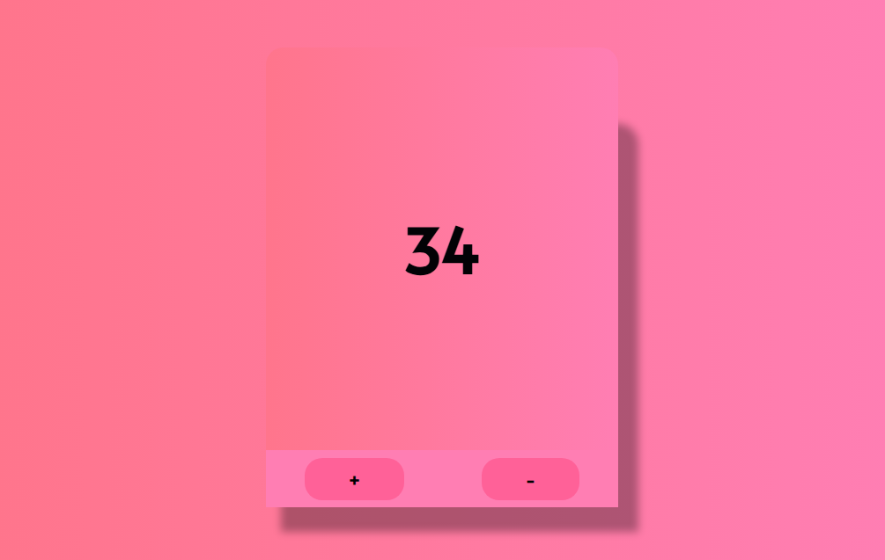

# counterliy  

Discover the ease and functionality of our Simple Counter, a user-friendly tool designed to help you keep track of counts effortlessly. Whether you need a counter for tracking events, managing inventory, or simply for fun, our intuitive interface makes it a breeze.

 

 
Key Features:

Easy-to-Use Interface: Our counter is designed with simplicity in mind. With a clean and straightforward layout, you can start counting with just a click.

Responsive Design: Use our counter on any device. Whether you're on a desktop, tablet, or smartphone, our site adapts seamlessly to your screen size, ensuring a great experience no matter where you are.

Increment and Decrement Functions: Easily adjust your count up or down with the convenient "+" and "-" buttons. This feature allows for precise control over your counting needs.

Reset Button: Quickly reset the counter to zero with a single click. Perfect for starting fresh without any hassle.

Real-Time Updates: Watch the counter change in real-time as you click. No need to refresh the page—everything updates instantly.

Accessible and Lightweight: Our website loads quickly and is accessible to everyone, with clear and readable text and controls that are easy to use.

How It Works:

Start Counting: Visit the site and use the "+" button to increase the count or the "-" button to decrease it.
Reset as Needed: Click the "Reset" button to bring the counter back to zero at any time.
Watch the Count: Your count updates immediately with each click, giving you instant feedback.
Who Can Use It?

Our Simple Counter is perfect for a wide range of uses:

Event Planners: Keep track of guest numbers at an event.
Inventory Managers: Count items quickly and efficiently.
Fitness Enthusiasts: Track repetitions during workouts.
Teachers and Students: Count down days to an event or keep track of classroom activities.

author : #Hussain Shamim 
